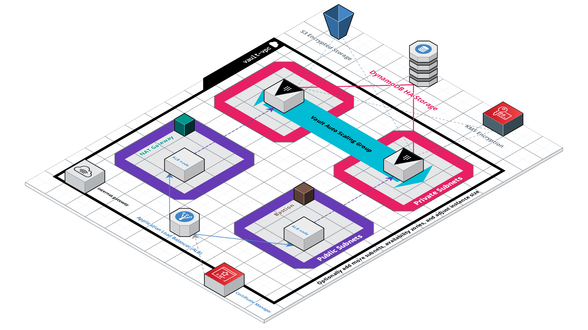

# Vault on AWS

A secure [Vault](https://www.hashicorp.com/products/vault) for secrets, tokens, keys, passwords, and more.  Automated deployment to AWS with [Terraform](https://www.terraform.io/).  Configurable options for security and scalability.  Usable with any applications and services hosted anywhere.

To use:

1. Have a domain name for your vault (i.e. secrets.domain.com).

2. Follow the [deployment instructions](#how-to-use-and-deploy-this-project).

3. Use the [Vault CLI](https://www.vaultproject.io/docs/commands) or [Vault HTTP API](https://www.vaultproject.io/api-docs) to create and manage secrets.

    ```sh
    # Point Vault at your domain.
    # - Traffic is encrypted.
    # - Data is encrypted before storage and at rest.  
    # - DDoS protected.
    # - Scoped to specified IP CIDR blocks.
    # - Optionally scoped to private networks (VPCs).
    export VAULT_ADDR=https://secrets.domain.com

    # Login as the admin. This token is given to you after deployment.
    vault login <ROOT_TOKEN>

    # Enable key/value secrets.
    vault secrets enable -path=secret kv-v2

    # Put a value.
    vault kv put secret/dev/api_key value=abc123

    # Get a value.
    vault kv get secret/dev/api_key # value=abc123
    ```

4. Create and manage users of secrets.

    ```sh
    # Enable the user / password form of auth.  There's other auth options.
    vault auth enable userpass

    # Make a policy that allows access of certain secrets.
    cat > dev_policy.hcl <<EOF
    # Admin of all secrets at this path only.
    path "secret/data/dev/*" {
      capabilities = ["create", "read", "update", "delete", "list"]
    }
    EOF

    # Tell Vault about the policy
    vault policy write dev_policy ./dev_policy.hcl

    # Create a user named developer_don with the policy
    vault kv put /auth/userpass/users/developer_don \
      password=dons_unguessable_pwd \
      token_policies=dev_policy
    ```

5. On a different server, login as a user and use secrets.

    ```sh
    # Point Vault at your domain
    export VAULT_ADDR=https://secrets.domain.com

    # Login as the developer user
    vault login -method=userpass \
      username=developer_don \
      password=dons_unguessable_pwd
    
    # Get a secret
    vault kv get secret/dev/api_key # value=abc123

    # Get a different secret
    vault kv get secret/database/password # Forbidden!
    ```

### Details

This project creates and manages a secure, scalable, and production-ready deployment of HashiCorp's [Vault](https://www.hashicorp.com/products/vault) on AWS.

Vault is deployed behind a domain of your choosing (i.e. https://secrets.domain.com).  You can then use that domain as your Vault endpoint to safely store/retrieve secrets using CLI commands, the HTTP API, and any other functionality that Vault provides.

Using settings in the project, you can also...

- Make the URL publicly available
- Scope the URL to a list of IP Addresses / CIDR Blocks
- Limit the URL to private usage only with other AWS VPCs
- Control the size / number of the Vault servers
- Configure a [variety of other options](#customizing-deployment)

This project requires that you have [Terraform 0.12+](https://www.terraform.io/) installed.  Both deployment and management should be done through Terraform.

If you'd like to watch how to set this up and use it [check out these videos]().  They walk you through the full deployment of this project from scratch.

## Table of Contents

- [Architecture](#architecture)
- [How to Use and Deploy This Project](#how-to-use-and-deploy-this-project)
- [Prerequisites for Deployment](#prerequisites-for-deployment)
- [Prerequisites for Private Deployment](#prerequisites-for-private-deployment)
- [Deploying the Project](#deploying-the-project)
- [Customizing Deployment](#customizing-deployment)
- [Operator Mode](#operator-mode)
- [Private Mode](#private-mode)
- [Questions](#questions)
- [License](#license)

## Architecture



### The Network

The network, or [AWS Virtual Private Cloud (VPC)](https://docs.aws.amazon.com/vpc/latest/userguide/what-is-amazon-vpc.html), consists of public subnets and private subnets.  The public subnets can give access to the internet and the private subnets optionally have access via [NAT](https://docs.aws.amazon.com/vpc/latest/userguide/vpc-nat.html).  The public subnets are where the load balancer nodes are deployed.  The private subnets are where the Vault instances are deployed.

The VPC also uses [VPC Endpoints](https://docs.aws.amazon.com/vpc/latest/userguide/vpc-endpoints.html) in order to keep traffic between DynamoDB and KMS internal.  [DynamoDB](https://docs.aws.amazon.com/amazondynamodb/latest/developerguide/Introduction.html) is the auto-scaling storage backend used for the encrypted Vault data.  [KMS](https://docs.aws.amazon.com/kms/latest/developerguide/overview.html), or Key Management Service, is used to seal and unseal Vault.

If you deploy it using the [private deployment settings](#prerequisites-for-private-deployment), you can specify other AWS VPCs in your AWS Account.  These VPCs will be given access to the Vault VPC through [VPC Peering](https://docs.aws.amazon.com/vpc/latest/peering/what-is-vpc-peering.html).  This means any resources and services in those external VPCs will be able to access Vault privately.

If you'd like to learn more about VPCs, [check out this guide](https://start.jcolemorrison.com/aws-vpc-core-concepts-analogy-guide/).

### Traffic Entry

The entry point to the architecture is through the Application Load Balancer (ALB).  The ALB is fronted by an SSL/TLS certificate provisioned through [AWS Certificate Manager](https://docs.aws.amazon.com/acm/latest/userguide/acm-overview.html) and redirects any non-HTTPS requests to HTTPS.  The ALB is deployed to a number of subnets, specified on deploy, that allows it to load balance between multiple Availability Zones.

If you deploy it normally, the Vault API will be available at a domain name of your choosing and scoped to any CIDR blocks you specify.  If you deploy it using the [private deployment settings](#prerequisites-for-private-deployment), the API will only be available to VPCs of your choosing that exist in the same AWS Account and Region.

In addition to HTTPS, the ALB is fronted by security groups (firewalls) that limit traffic ONLY to HTTP and HTTPS requests (HTTP is redirected).  Furthermore, ALB's are protected by DDoS attacks due to [AWS Shield](https://docs.aws.amazon.com/waf/latest/developerguide/shield-chapter.html).

### The Vault Servers

The Vault Servers, hosted on EC2 Instances, are created using an [Auto Scaling Group (ASG)](https://docs.aws.amazon.com/autoscaling/ec2/userguide/AutoScalingGroup.html).  This ensures that if any instance goes down, it's automatically replaced.  Furthermore, it allows for rolling deploys when you update the [Launch Template](https://docs.aws.amazon.com/autoscaling/ec2/userguide/LaunchTemplates.html) that the ASG uses as a blue print to create instances from.

The Vault Servers themselves are given the bare-minimum permissions, through [IAM Policies](https://docs.aws.amazon.com/IAM/latest/UserGuide/access_policies.html), required to interact with DynamoDB, KMS, and put encrypted files to S3.  They receive an [IAM Role](https://docs.aws.amazon.com/IAM/latest/UserGuide/id_roles.html) that gives them temporary credentials that are automatically rotated.

After turning off [operator mode](#operator-mode), the Vault Servers have ZERO access to the public internet.  Only requests coming from the Application Load Balancer (ALB).  Communication with DynamoDB and KMS happen through VPC Endpoints and HTTPS.  [Vault Servers communicate through the storage backend](https://www.vaultproject.io/docs/concepts/ha.html#server-to-server-communication), which means communication between Vault Servers is also a non-issue.

Because all traffic between AWS services and the Vault Servers occur via HTTPS, TLS is terminated at the Load Balancer.  This cuts down the added encryption overhead and need for extra certificates.  Since the VPC, and the subnets the Vault Servers exist in, are completely locked down, there is no chance for compromise unless you were to use this VPC for something OTHER than Vault.

However, if you need to give AWS resources in external VPCs access to Vault, use [VPC Peering](https://docs.aws.amazon.com/vpc/latest/peering/what-is-vpc-peering.html).  Don't worry, this project can do that automatically for you as outlined in the [private deployment settings](#prerequisites-for-private-deployment) section.

If you'd like to learn more about IAM, security, and the IAM Policy language, [check out this guide](https://start.jcolemorrison.com/aws-vpc-core-concepts-analogy-guide/).

### Serverless, High Availability Storage

This project uses DynamoDB in [on-demand mode](https://docs.aws.amazon.com/amazondynamodb/latest/developerguide/HowItWorks.ReadWriteCapacityMode.html#HowItWorks.OnDemand) which means that no management is required for server capacity, storage, or throughput.  When Vault is in [High Availability Mode](https://www.vaultproject.io/docs/concepts/ha), it enables multiple Vault Servers in the deploy.  At any given time, one Vault Server will be "active" and serving the incoming requests / writing / reading the encrypted data.  Other Vault Servers are put in "stand-by" mode in the case that the "active" server fails.

In addition to communicating with DynamoDB through HTTPS VPC Endpoints, stored data is also encrypted at rest with [AES-256](https://en.wikipedia.org/wiki/Advanced_Encryption_Standard).

Although S3 is an alternative, [it does not support high availability mode](https://www.vaultproject.io/docs/configuration/storage/s3).  The S3 bucket in this project is ONLY used for the first deploy.  Upon initialization of the Vault, the Vault Server will encrypt the unseal keys and root token and upload them to the S3 bucket via HTTPS.  The S3 bucket also encrypts the data at rest using AES256.  This S3 bucket is ONLY accessible by the root account owner or an IAM Administrator User.

This project configures DynamoDB to work with Vault automatically, so no tables are needed up-front.  Additionally the Vault Servers have IAM permissions limited to JUST the table, streams, and indices of the DynamoDB table that Vault is using.

### Operator Resources

On first deploy [operator mode](#operator-mode) is enabled.  This creates a temporary Bastion server, NAT Gateway, and needed VPC routing.  This allows the deploy to grab the Vault installation and also for you to SSH into the instances if needed.  When this mode is on, Vault Servers are reachable via the Bastion and are cleared to make outbound internet requests.  The only inbound traffic is from the Bastion server itself and from stateful responses from outbound requests.

After your first deployment is complete, you can turn off operator mode.   Upon doing so the Bastion, NAT, and all VPC routing is destroyed.  This will lock everything entirely and also save you from paying the costs of having those resources live.

## How to Use and Deploy This Project

1. Have [Terraform 0.12+](https://www.terraform.io/) installed.
2. Follow the [Prerequisites for Deployment](#prerequisites-for-deployment) instructions.
3. Optionally follow the [Prerequisites for Private Deployment](#prerequisites-for-private-deployment) instructions.
4. Follow the [Deploying the Project](#deploying-the-project) instructions.
5. Start using it.

There are some manual steps that need to be taken, but its due to the nature of registering domain names, handling private keys, and provisioning SSL/TLS certificates.  These instructions are included in this document.

After deploying the project [use the Vault documentation](https://www.vaultproject.io/docs) and [Vault API documentation](https://www.vaultproject.io/api-docs) to interact with your Vault deployment.

You can also watch a walk through of installation, deployment, basic usage and concepts for this project. [Checkout the videos here]().

## Prerequisites for Deployment

Before deploying, there's a few things that have to be done manually.  None of these should be a barrier unless you're new to the world of AWS.  Also, some of them might seem long, but that's only because the steps are spelled out in detail.  **In reality, this can all done in a handful of minutes.**

What you need in a nutshell:

- A registered domain name.
- An AWS Account.
- An Admin IAM User created.
- The AWS CLI installed and configured.
- A Certificate Manager SSL/TLS Certificate.
- An EC2 Key Pair.

Note: make sure that you do these steps in the same AWS Region.

#### 1 - Have a registered a domain name

Simple enough.  It doesn't have to be on AWS either.

#### 2 - Have an AWS Account

This should probably be obvious, but just in case.

#### 3 - Have an Admin IAM User created in your AWS Account

This admin user needs programmatic access and the `AdministratorAccess` IAM policy attached.  

<details>
    <summary>To set this up, if you don't already have it...</summary>

1. Head to IAM and click on **Users**.

2. Click on **Add user**.

3. In the **Set user details**, give the user whatever user name you want.

4. In the **Select AWS access type**, ensure that both **Programmatic access** and **AWS Management Console access** are checked.

5. Click **Next: permissions**.

6. In the **Set permissions** area, click on **Attach existing policies directly**.  Select the **Administrator Access** policy.

7. Click **Next: Tags**.

8. On the **Add tags** screen, optionally give your user tags.

9. Click **Next: Review** and then click **Create user**.

10. On the **Success** screen click **Download .csv**.  This has all of the credentials you need.

</details>

#### 4 - Have the AWS Command Line Interface Installed and Set up

The [AWS Command Line Interface](https://docs.aws.amazon.com/cli/latest/userguide/cli-chap-welcome.html) should be installed and configured with an IAM Admin User.  Both Version 1 and Version 2 are fine.

While this isn't a strict requirement, [since Terraform can interpret AWS credentials in many ways](https://www.terraform.io/docs/providers/aws/index.html#authentication), you'll need it to decrypt your Vault credentials after deploy.

<details>
    <summary>To install and configure the CLI...</summary>

1. [Follow these instructions](https://docs.aws.amazon.com/cli/latest/userguide/install-cliv2.html) to install the AWS CLI.

2. After installing the CLI, run `aws configure` and use the credentials you downloaded from the previous step.
    - For region, the default one the project uses is `us-east-1`.  If you want a different region, you'll have to specify it in the Terraform project variables `terraform.tfvars` file.

This will set up your credentials as the `default` AWS profile.  When Terraform goes to deploy this project, it will use those credentials to do so.  If you want to use a different profile run:

```
aws configure --profile other_profile_name
```

Finally, remember the profile name for your `terraform.tfvars`.  We'll need to set this later on to tell Terraform which profile to use when deploying the project.  For example:

```
aws_profile = "other_profile_name"
```

</details>

#### 5 - Create a Certificate in AWS Certificate Manager

In order to enable HTTPS for the Application Load Balancer, an SSL/TLS certificate is required.  The most straightforward and free way to do so is with [AWS Certificate Manager](https://docs.aws.amazon.com/acm/latest/userguide/acm-overview.html).  You need a certificate created for the domain you intend your Vault deployment to be reachable at (i.e. `secrets.domain.com`).

<details>
    <summary>To create an SSL/TLS certificate with AWS Certificate Manager...</summary>

1. Make sure you're in the correct region that you'll be deploying everything in (i.e. `us-east-1` aka "N. Virginia").

2. As your root account (or newly created admin user), head to the **Certificate Manager** console.

3. Click **Request a Certificate**.
    - if you've never used Certificate Manager before, click **Get Started** under the **Provision certificates** column.

4. Ensure that **Request a public certificate** is selected and click **Request a certificate**.

5. In the **Add domain names** screen, put the domain name you want the vault deployment to be available at.  Click **Next** when done.
    - suggestion for simplicity: use `secrets.yourdomain.com` where `yourdomain.com` is the domain name you own.

6. On the **Select validation method** choose whichever method works best for you.  Click **Next**.
    - If your domain is through Route53, DNS validation will be almost instant.  If not, DNS validation can take "up to an hour" which can actually be FAR MORE than an hour.
    - If your domain is NOT on Route53, email validation will probably be faster.

7. On the **Add Tags** screen, optionally add any tags you want and then click **Review**.

8. On the **Review** screen click **Confirm and request**.

If you selected **DNS validation**, [follow these instructions](https://docs.aws.amazon.com/acm/latest/userguide/gs-acm-validate-dns.html) to complete the process.  Note that these are for Route53, which hilariously can be done automatically if you're on it.  If you're on another domain name registrar (i.e. Namecheap), you'll need to go and create a custom CNAME record with the values.

If you selected **Email validation**, [follow these instructions](https://docs.aws.amazon.com/acm/latest/userguide/gs-acm-validate-email.html).  This is as simple as waiting for the email, clicking on it, and then clicking another button.  Note that this email will be sent to the contact addresses listed in WHOIS for the domain.

</details>

#### 6 - Create an EC2 Key Pair

This is the SSH key that can be used in [operator mode](#operator-mode).  This is the key used to jump into the bastion server that can then access the vault servers themselves.  Without it you're locked out of the servers.  This key is created and managed via [EC2 Key Pairs](https://docs.aws.amazon.com/AWSEC2/latest/UserGuide/ec2-key-pairs.html).

While this key isn't directly used in any of the set up or management, its useful if you want to explore or debug the vault servers themselves.

<details>
    <summary>To create an EC2 Key Pair...</summary>

1. Make sure you're in the correct region that you'll be deploying everything in (i.e. `us-east-1` aka "N. Virginia").

2. As your root AWS account user or Admin IAM user, head to the **EC2** console.

3. In the side navigation click on **Key Pairs**.

4. In the **Key pairs** screen click **Create key pair**.

5. For **name** input whatever you'd like (i.e. `vault-deployment-key`)

6. For **File format** leave `pem` selected.

7. Click **Create key pair**.  This will download the key.

8. Move the key to your `.ssh` folder (or wherever you'd like):

    ```sh
    # example on MacOS
    mv ~/Downloads/name-of-key.pem ~/.ssh/
    ```

9. Add the key to your ssh-agent:

    ```sh
    # restrict permissions
    chmod 400 ~/.ssh/name-of-key.pem

    # linux/windows - add it to the agent
    ssh-add name-of-key.pem

    # MacOS - add it to the agent
    ssh-add -K name-of-key.pem
    ```

</details>

## Prerequisites for the Private Deployment

If you want your Vault endpoint publicly accessible or scoped to specific CIDR blocks, skip to the [Deploying the Project](#deploying-the-project) section.

If you want your Vault endpoint accessible only from other VPCs within AWS, read on.

**In a nutshell**, you need a list of VPC IDs that are in the same account and region that you intend to deploy this project to.  They should all have [DNS Hostnames](https://docs.aws.amazon.com/vpc/latest/userguide/vpc-dns.html#vpc-dns-hostnames) enabled.  None of the VPCs should have a CIDR block that overlaps with the Vault VPC.  More details below.

#### Explanation of the Private Deployment

To keep the Vault deployment completely isolated, everything is contained in its own private network (VPC).  When you deploy this in "Private Mode" it makes it unaccessible from the public internet.  The endpoint will no longer resolve to a public IP address - it will only have a private IP address.

The only way to connect to the endpoint is to use [VPC Peering](https://docs.aws.amazon.com/vpc/latest/peering/what-is-vpc-peering.html).  In essence, this makes it so that other, external VPCs of your choosing are allowed access to the Vault VPC.  When VPC peering is set up, resources in your external VPCs will be able to access the Vault VPC and its endpoint.

*"Do we still need an SSL/TLS certificate and domain name?"*

For this implementation, yes.  AWS's Application Load Balancers, when set to "internal" mode (which keeps them private), still resolve their DNS publicly.  That means that when your private deployment is launched, and you go to access the endpoint from a server in your external VPC, you'll still be able to do so by pointing to whatever domain name you have setup (i.e. https://secrets.domain.com).

#### Detailed Requirements for the External VPCs

External VPCs that you want to give access to the Vault VPC need to...

1. Be in the same AWS Account AND Region as your Vault deployment.

    If you need inter-region, multi-cloud, or multi-account use the normal deployment and scope the allowed CIDR blocks using the `allowed_traffic_cidr_blocks` and `allowed_traffic_cidr_blocks_ipv6` input variables.

    Direct inter-region support and multi-account may be added at a later time.  However, most teams / organizations will do their production deploys in a singular AWS Account.  Other accounts are typically used for monitoring and logging, auditing, billing, development environments, etc.

2. Have a CIDR Block that **DOES NOT** overlap with the Vault VPC CIDR.

    The default Vault VPC CIDR Block is `10.255.0.0/20`.  That means that whatever VPC you'd like to connect to the Vault VPC CANNOT overlap with this.  The simplest way to avoid this is to just ensure that nothing in `10.255.0.0` is used at all in your other VPCs.

    Optionally, you can change the Vault VPC CIDR block using the `vpc_cidr` variable in your `terraform.tfvars` file.

3. Have [DNS Hostnames](https://docs.aws.amazon.com/vpc/latest/userguide/vpc-dns.html#vpc-dns-hostnames) enabled.

    The DNS Hostnames option let's public DNS hostnames resolve to private IP addresses in the peered VPC.  In plain english, this means that services and instances in your existing VPC can target the private Vault Load Balancer DNS and it actually work.  Because, for whatever reason, internal AWS load balancers, ONLY have public DNS names.

    To do so, navigate to your VPC in the AWS console, select it, click on **Actions**, click **Edit DNS Hostnames**, check the **Enable** box and save it.

4. Use the VPC's Main Routing Table.

    The main routing table is used simply because it can be automated easily in Terraform.  If you want to use a different routing table, you'll have to configure that manually.  It's not too difficult, but in order to keep things automated, it uses the main one.

    To get around this, before deploying, if you have a routing table you want used, there's a way.  Select the routing table in the console, click **Actions**, and then click **Set Main Route Table**.  If you do this before deploying the Terraform project, this one will be used instead.

## Deploying the Project

Deploying and managing the project should all be done through Terraform.

Again, you can also watch a walk through of deploying this project in [these videos]().

#### 1 - Clone the Project

Create a directory for this project and clone it with git:

```sh
mkdir vault-on-aws && cd $_

git clone <this_repo_url> .
```

#### 2 - Initialize the Terraform Project

1. In the project directory, initialize the terraform project:

    ```
    terraform init
    ```

2. In the project directory create a file to store your variables:

    ```
    touch terraform.tfvars
    ```

    - yes, name it exactly `terraform.tfvars`.  That name will tell Terraform to automatically load the values you put into it.

3. In `terraform.tfvars` add the following information:

    ```hcl
    # The domain name your SSL/TLS certificate was created for.
    domain_name = "secrets.example.com"

    # The name of your EC2 key pair WITHOUT ".pem" added to it
    ec2_key_pair_name = "name-of-key"

    # If you didn't create a named AWS profile, omit this.  Otherwise use the profile you created in early steps.
    # aws_profile = "some_profile"

    # If you want to scope allowed traffic to specific CIDR blocks
    # allowed_traffic_cidr_blocks = ["0.0.0.0/0"] # default value

    # If you want to scope allowed traffic to specific IPv6 CIDR blocks
    # allowed_traffic_cidr_blocks_ipv6 = ["::/0"] # default value
    ```

    - for more information on things you can change about it, check out the `terraform.tfvars.example` file.

##### Private Deployment

If you're doing the private deployment, you'll need to add two more variables here:

```hcl
# Flag to deploy the project as private
private_mode = true

# ID of VPCs that can access the Vault Deployment's VPC and, as a result, the Vault endpoint.
peered_vpc_ids = ["EXTERNAL_VPC_ID_1", "EXTERNAL_VPC_ID_2"]
```

<details>
    <summary>More details on these variables...</summary>

`private_mode = true`

This tells the Terraform project to keep everything private, create VPC peering connections, and create the proper routes.

`peered_vpc_ids = ["EXTERNAL_VPC_ID_1", "EXTERNAL_VPC_ID_2"]`

This is the list of IDs for the VPCs that you want to be able to access the Vault VPC, and thus its load balancer and endpoint.  To get this, go to your VPC in the console, select it, and grab the **VPC-ID** value.

Finally, if using `private_mode`, the variables `allowed_traffic_cidr_blocks` can be left at `0.0.0.0/0` since that will only enable incoming traffic from the external VPCs.  Remember, in private mode the load balancer HAS no public IP address and is therefore unreachable from the public internet.

</details>

#### 3 - Deploy the Terraform Project

Assuming everything above is done, run:

```
terraform apply
```

#### 4 - Get Your Vault Credentials

1. Run the `./temp/vault_credentials.sh` script.  This script is generated after running `terraform apply`.

    ```
    . ./temp/vault_credentials.sh
    ```

    Alternatively, open up the script and run the two commands yourself.

2. Open up the `./temp/vault_creds_decrypted` file to find your [Vault Shamir keys](https://www.vaultproject.io/docs/concepts/seal) and root token.

3. Take note of the `Load Balancer DNS Name` for the next step.

#### 5 - CNAME or Alias Your Load Balancer's DNS Name

Given the `Load Balancer DNS Name`, you have two options:

1. Create a CNAME record for the load balancer DNS.

2. Create an Alias for the load balancer DNS IF you're using Route53.

Option #1 works whether your on Route53 or not, Alias's are free and easily integrated though.

To CNAME the load balancer DNS, do so like you would with any other domain name you'd like to CNAME.

<details>
    <summary>General Instructions...</summary>

1. Head to your Domain Name Registrar (i.e. Namecheap).

2. Find the DNS Records area.

    This is where you can create CNAME, A, SOA, TXT records and so on.

3. Create a CNAME record.

4. Use the subdomain, from your SSL/TLS certificate you created in the [Prerequisites for Deployment](#prerequisites-for-deployment) section, as the "host" or "name" value.

    i.e. `secrets` if your SSL/TLS certificate was for `secrets.domain.com`.

    "Host" and "name" will vary based on the registrar.

5. Use the `Load Balancer DNS Name` as the value for the record.

6. Save the record.

Note that these instructions are "general" and will change based on the domain name registrar.

</details>

To create an Alias, [follow these instructions](https://docs.aws.amazon.com/Route53/latest/DeveloperGuide/routing-to-elb-load-balancer.html).

#### 6 - Check out your vault!

Navigate to your domain name on HTTPS and you'll see the Vault UI ready to accept values.  You can obviously also interact with it via the vault CLI and through the HTTP API as well.

To work with it via the Vault CLI, have vault installed on whatever machine you're looking to use it on and export the correct `VAULT_ADDR`:

```sh
export VAULT_ADDR=https://secrets.mydomain.com

vault status
```

## Customizing Deployment

The `variables.tf` file includes all options and settings that you can tweak in context of the project.  It also includes descriptions for what they affect.  

The `terraform.tfvars.example` gives an example of using these variables to customize the deployment.  It includes descriptions and reasoning for why you might change or use some of them.

The variables are listed in order of importance.

- `domain_name` - The domain name, without protocol or trailing paths, for which you've provisioned an SSL/TLS certificate via [AWS Certificate Manager](https://docs.aws.amazon.com/acm/latest/userguide/acm-overview.html).  Example would be `secrets.domain.com`.  **This variable is required**.

- `ec2_key_pair_name` - The name of an existing `.pem` [EC2 Key Pair](https://docs.aws.amazon.com/AWSEC2/latest/UserGuide/ec2-key-pairs.html) that is in the same AWS Account and Region of the Vault deployment.  Do not include the `.pem` extension in the name.  For example, if the key is called "my_key.pem" input `my_key`.  **This variable is required**.

- `aws_profile` - The AWS Profile to use for this project. Defaults to the `default` profile created when running `aws configure`.

- `aws_default_region` - The default AWS region to deploy the Vault infrastructure to.  Defaults to `us-east-1`.

- `main_project_tag` - A tag value that will be attached to every resource created by this project.  It's also used to name-prefix certain resources.  Defaults to `vault-deployment`.

- `vault_version` - What version of Vault to use.  Defaults to `1.4.0`.

- `operator_mode` - Whether or not to create the NAT and Bastion needed to allow operator access to the Vault Servers.  **Must be left `true` on first time deploys**.  After first time deployment, set it to `false` to remove the Bastion, NAT, and all related networking resources.  Defaults to `true`.

- `private_mode` - Whether or not the Vault deployment, and its endpoint, should be made publicly available or kept private to AWS.  When this is on the endpoint **has no public IP address** and is thus unreachable from the internet.  It will only be reachable from the internal network.  See [Private Mode](#private-mode) for more details.  Defaults to `false`.

- `peered_vpc_ids` - IDs of AWS VPCs that should be allowed to access the Vault VPC via [VPC Peering](https://docs.aws.amazon.com/vpc/latest/peering/what-is-vpc-peering.html).  These VPCs should be in the same AWS Account and Region as the Vault deployment.  This variable is only relevant if `private_mode` is set to `true`.  Defaults to `[]`.

- `allowed_traffic_cidr_blocks` - A list of IPv4 CIDR blocks that are allowed to send requests to your Vault endpoint.  Defaults to `["0.0.0.0/0"]` which means everywhere.

- `allowed_traffic_cidr_blocks_ipv6` - A list of IPv6 CIDR blocks that are allowed to send requests to your Vault endpoint.  Defaults to `["::/0"]` which means everywhere.

- `allowed_bastion_cidr_blocks` - A list of IPv4 CIDR blocks that are allowed to SSH into your Vault Bastion server.  SSH access requires ownership of the `ec2_key_pair_name` key, which, unless you're giving out like halloween candy, should be safe.  Only used if `operator_mode` is set to `true`.  Defaults to `["0.0.0.0/0"]` which means everywhere.

- `allowed_bastion_cidr_blocks_ipv6` - A list of IPv6 CIDR blocks that are allowed to SSH into your Vault Bastion server.  Only used if `operator_mode` is set to `true`.  Defaults to `[]`.

- `vpc_cidr` - The IPv4 CIDR block for the Vault VPC.  For consistency use either a `/16` or `/20` subnet mask.  Defaults to `10.255.0.0/20`.
    - NOTE: If using `private_mode` and connecting with external VPCs, the external VPCs' CIDR Blocks CANNOT overlap with the Vault VPC's CIDR block.

- `vpc_instance_tenancy` - [Tenancy](https://docs.aws.amazon.com/AWSEC2/latest/UserGuide/dedicated-instance.html#dedicated-howitworks) for instances launched into the VPC.  Defaults to `default`.

- `vpc_tags` - A [map](https://www.terraform.io/docs/configuration/types.html#map-) of additional tags to add to the launched Vault VPC.  Defaults to `{}`.

- `vpc_public_subnet_count` - The number of public subnets to create and subsequently launch the Application Load Balancer into.  This can number cannot exceed the [number of availability zones](https://aws.amazon.com/about-aws/global-infrastructure/regions_az/) in the AWS region you deploy to.  A higher number means more fault-tolerance since load balancer nodes will be spread out amongst more data centers.  Defaults to `2`.

- `vpc_private_subnet_count` -  The number of private subnets to create.  The private subnets are where the Vault Servers are launched.  This can number cannot exceed the [number of availability zones](https://aws.amazon.com/about-aws/global-infrastructure/regions_az/) in the AWS region you deploy to.  For consistency, this value should match `vpc_public_subnet_count`. A higher number means more fault-tolerance since Vault Servers will be spread out amongst more data centers.  Defaults to `2`.

- `vault_instance_type` - The [AWS EC2 Instance Type](https://aws.amazon.com/ec2/instance-types/) used for the Vault Servers.  The instance type determines how powerful the servers.  For example `"t2.micro"` which can handle roughly 1000 concurrent requests.  `"t2.medium"` can handle about 20,000 concurrent requests.  The size you use should be based on your needs.  Changing this after deployment will modify the underlying template and enable you to deploy new versions.  This means you can start small and upgrade to larger instances as needed.  Defaults to `"t2.medium"`.
    - A handy chart for comparing [EC2 Instance types](https://www.ec2instances.info/).

- `vault_instance_count` - The number of Vault Servers to launch into the private subnets.  Note that in [High Availability mode](https://www.vaultproject.io/docs/concepts/ha), only ONE server is used as the active server.  All other servers are put into "Standby" and are made "Active" if the current active server dies.  However, [Vault is typically bounded by the limits of the Storage backend](https://www.vaultproject.io/docs/internals/high-availability#design-overview) instead of the servers themselves.  Defaults to `2`.

- `use_lastest_ami` - Whether or not to use the latest [Amazon Linux 2](https://docs.aws.amazon.com/AWSEC2/latest/UserGuide/amazon-linux-ami-basics.html) AMI for the Vault and Bastion servers.  If `true` it will pull and use the latest version.  If false, it will use the AMI `"ami-0323c3dd2da7fb37d"`.

- `dynamodb_table_name` - Name of the DynamoDB table used by the Vault HA storage backend.  Defaults to `"vault_storage"`.

- `kms_tags` - A [map](https://www.terraform.io/docs/configuration/types.html#map-) of additional tags to add to the KMS key used to seal and unseal Vault.  Defaults to `{}`.

## Operator Mode

As noted in the [architecture](#architecture), operator mode creates a bastion server, NAT Gateway, and all needed routing in the VPC to enable you to safely access your Vault Servers via SSH.  This is turned on by default and **required** on first time deploy.

To use the created bastion server to access your Vault Servers...

1. SSH into your bastion instance using its public IP address and ssh forwarding:

    ```
    ssh -A ec2-user@BASTION_PUBLIC_IPV4
    ```

2. From there, SSH into either of your Vault Servers using their private IP address:

    ```
    # from the bastion
    ssh ec2-user@VAULT_INSTANCE_PRIVATE_IPV4
    ```

To turn off operator mode:

1. Set `operator_mode = false` in your `terraform.tfvars` file.

2. Run `terraform apply` and confirm.

This will destroy the bastion server, NAT Gateway, and all associated routing leaving the Vault Servers completely closed.

## Private Mode

By default, this project will deploy the Vault behind a "public" HTTPS endpoint at the domain name that you specify.  This endpoint can be made completely open and addressable from the public internet.  This endpoint can also be limited to specific CIDR blocks (IP addresses) as well.

However, if you want to keep your deployment *entirely* private, you can set `private_mode = true` in the `terraform.tfvars` file prior to deployment.  This will make it so that the Application Load Balancer doesn't receive a public IP address, which means its unreachable from the internet.  This means it will only be accessible from the Vault VPC.

Other VPCs in the **same AWS Account and Region** can be given access to the Vault VPC, and thus the Load Balancer and Vault, through [VPC Peering](https://docs.aws.amazon.com/vpc/latest/peering/what-is-vpc-peering.html).  To do so, specify a list of VPC IDs in your `terraform.tfvars` file like so:

```hcl
private_mode = true

peered_vpc_ids = ["vpc-12345678901234567", "vpc-09876543210987654"]
```

These VPCs MUST have [DNS Hostnames](https://docs.aws.amazon.com/vpc/latest/userguide/vpc-dns.html#vpc-dns-hostnames) enabled.  The peering connection will be created with the VPCs' [Main Routing Table](https://docs.aws.amazon.com/vpc/latest/userguide/VPC_Route_Tables.html#RouteTableDetails).  If you want another routing table to be given the peering connection, [set it as the main route table](https://docs.aws.amazon.com/vpc/latest/userguide/WorkWithRouteTables.html#Route_Replacing_Main_Table).

Finally the VPCs' CIDR blocks CANNOT overlap with the Vault VPC's CIDR block.  The default Vault VPC CIDR is `10.255.0.0/20`.  That means you COULD NOT use an external VPC who's CIDR block is something like `10.255.0.0/24`.  However, using something like `10.0.0.0/16` or `10.25.0.0/20` is perfectly acceptable.

In the above example, the two VPCs would have a peering connection set up with the Vault VPC.  Assuming that the Vault VPC is set to `10.255.0.0/20`, and the other two VPCs have a VPC CIDR of `10.0.0.0/16` and `10.1.0.0/16`, both would then be able to access the load balancer.  Without the peering connection, routing to an address in the `10.255.0.0` range would mean nothing.

The reason VPC Peering is **recommended** over launching more services into the Vault VPC is to allow for complete security.  By ensuring that no other services and servers are intermingling with the public and private subnets, no potential threats are present.  Since you're probably using this to store sensitive data, keeping throughput and openings to a minimum is critical.

For a full example of deploying and using the `private_mode` set up, [checkout these videos]().  They demonstrate the requirements, usage with external VPCs, and interacting with Vault from EC2 instances in external VPCs.

## Questions

#### How can I update the Size and Number of the Vault Servers?

1. Change the size of Vault servers using the `vault_instance_type` variable.

2. Change the number of Vault servers using the `vault_instance_count`.

Because [Auto Scaling Groups](https://docs.aws.amazon.com/autoscaling/ec2/userguide/AutoScalingGroup.html) to not currently update after changing the version of the [Launch Templates](https://docs.aws.amazon.com/autoscaling/ec2/userguide/LaunchTemplates.html), you'll need to extend the `vault_instance_count` x2 of what it was.  After those instances are healthy, change the `vault_instance_count` back to its original number and the older instances will be killed off.

Oddly enough, the older version of Launch Templates known as [Launch Configurations](https://docs.aws.amazon.com/autoscaling/ec2/userguide/LaunchConfiguration.html) would enable you to change these variables and have the update happen automatically.  If Launch Templates aren't updated to make Auto Scaling Groups respond automatically, this project may switch back to Launch Configurations.

#### How can I delete the Vault deployment?

Delete everything in the created S3 bucket and Simply run `terraform destroy` in your project directory.  This will delete everything.  

#### Can I use this in existing Terraform projects?

Although this module isn't currently on the Terraform Registry, you can absolutely use it in an existing project.  You'll need to use it as a custom module though.

1. Created a nested folder in your existing Terraform project.

    ```
    # assuming you're in your Terraform project directory...
    mkdir - p ./modules/vault_deploy/
    ```

    This is how you would begin ANY custom module.

2. Clone the project into your newly created, nested folder:

    ```
    # Clone the repo
    git clone git:repo ./modules/vault_deploy/

    # Remove the repo's .git folder
    rm -rf ./modules/vault_deploy/.git
    ```

    Removing the `.git` folder will ensure that this repo's git history and settings don't interfere with your own.

3. Use the module like any other [Terraform custom module](https://www.terraform.io/docs/modules/index.html).

    ```hcl
    module "vault_deployment" {
      source = "./modules/vault_deploy
      
      # Required Variables
      domain_name = "secrets.domain.com"
      ec2_key_pair_name = "vault_key_pair"

      # Other variables
      # ...
    }

    # Example output
    output "vault_vpc_id" {
      value = module.vault_deployment.vpc_id
    }
    ```

#### Is it okay to use the Normal Deployment?

Yes.  Even though the endpoint is made public, all connections are done over HTTPS.  Using options you can also scope it down to only allow connections from CIDR blocks of your choosing (i.e. your company or your own IP).  If you trust SSL/TLS, then this is secure.

*What about IP spoofing?*

This is incredibly difficult to do, almost to the point where it'd be easier to compromise one of the machines involved in the connection.  Furthermore, IP spoofing doesn't allow for two way conversations since the response will always go back to the REAL IP address.

Finally, to do anything meaningful they need a valid vault login and token.  These can only be made and distributed by whoever is operating Vault.

*What about DDoS?*

AWS Application Load Balancers are protected with [AWS Shield](https://aws.amazon.com/shield/) Standard.  This protects them from DDoS attacks.

*Which would you use?*

It depends.  If you have everything in AWS, doing it privately would be the "ultimate" secure set up.  You would select the VPCs that have your resources that need access to Vault, and use those as the external VPCs.

However, if your infrastructure is split between on-premises, multiple cloud providers, services, and more, the normal deployment will be more accommodating.  Simply scope the allowed traffic down to only CIDR blocks that you trust using the `allowed_traffic_cidr_blocks` and `allowed_traffic_cidr_blocks_ipv6` variables in your `terraform.tfvars` file (more on this below).

Using this set up is no different than trusting a service like AWS Secrets Manager, AWS Key Management Service, or SSM Parameter Store.  Those requests, unless you're using VPC Endpoints, are all done over HTTPS and the public internet.

#### How does this compare to AWS Secrets Manager and SSM Parameter Store?

This is more a question of how does VAULT compare to those two services.  In terms of simply locking down secrets, any of them can do the job just fine.  However, Vault comes with an entire set of features, management, and other functionality around things BEYOND just key-value pairs.  It can generate and connect with [almost every cloud provider](https://www.vaultproject.io/docs/secrets) in terms of managing credentials, keys, secrets, and certificates.

The main downside of Vault is primarily operations and upkeep, however, this project should abstract most of that away from you.  Upgrading server size and count can be done with a few parameter changes.  Storage is a non-issue since DynamoDB scales automatically and indefinitely.  This leaves using Vault for its intended functionality as the main workload.

Cost and limits are also something to consider.  SSM Parameter Store is "free" up to a certain point where as Secrets Manager is priced both per secret stored AND per API request made.  In addition, [SSM Parameter Store has limits](https://aws.amazon.com/about-aws/whats-new/2019/04/aws_systems_manager_now_supports_use_of_parameter_store_at_higher_api_throughput/) on how many requests can be made per second as does [Secrets Manager](https://docs.aws.amazon.com/secretsmanager/latest/userguide/reference_limits.html#reference_limits_max-min).

On the other hand, costs with this deployment are based on the infrastructure itself.  Although you will have to pay an upfront cost, since the resources have a fixed cost regardless of usage, they will scale better.  Furthermore, you won't run into any arbitrary limits beyond what your settings allow for.

Think of it like ordering a sandwich vs. buying an automatic sandwich maker.  Ordering a sandwich is like SSM and Secrets Manager.  You're going to pay more, but only when you actually WANT the sandwich.  On the other hand, the automatic sandwich maker is like the Vault deployment.  It's going to cost more upfront, but may save you money in the long run since you can crank out sandwiches at will.

#### What scenarios does this deployment best fit?

There's three main "best fit" scenarios:

1. Deployments where you need a consistent stream of secrets read and written.

2. Deployments that aren't centered in one cloud-provider or on-premise infrastructure.

3. Deployments where you want fine-grained permissions control over secrets.

If, however, you're on one-cloud provider with a simple application architecture and all you need is somewhere to store a few passwords and keys, using an on-demand service is simpler.

#### How can I support the project?

- Make a pull request to contribute to the code!
- Submit issues and bugs for future improvements!
- Support the maintainer by sharing or [learning at AwsDevops.io](https://awsdevops.io/)!
- Make suggestions for better features and automation!

## License

View the [LICENSE](LICENSE) file for rights and limitations (MIT).